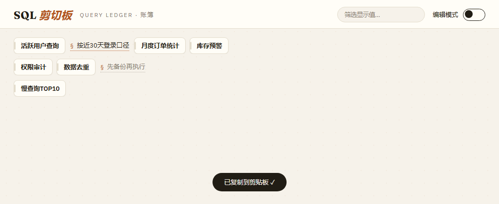
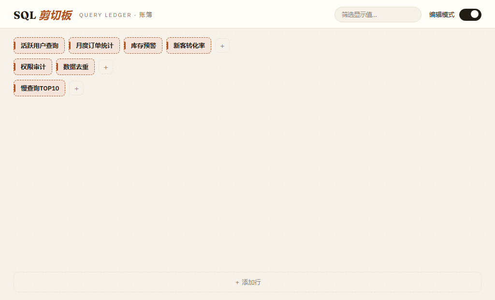
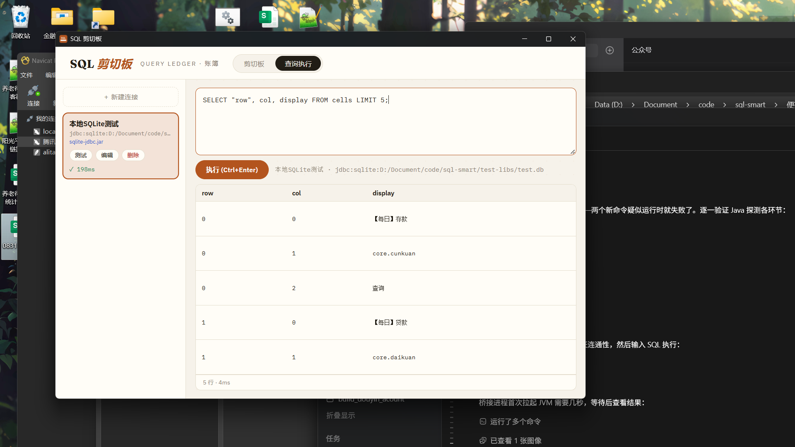
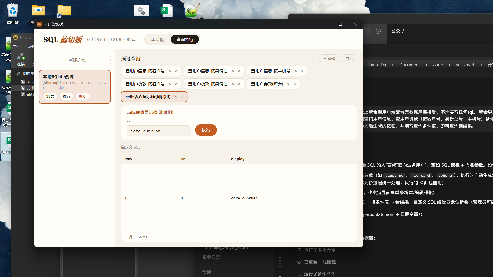

# SQL 剪切板

> 轻量便携的桌面 SQL 剪切板工具 —— 可自由拓展的表格管理常用 SQL，单击单元格即复制。



## ✨ 功能特性

- **一键复制**：单击单元格，该格的「复制值」（SQL）立即写入剪贴板，并有 toast 提示
- **右键菜单**：任意模式下右键单元格，可直接编辑或删除
- **字体调节**：右上角「Aa」图标，悬停展开滑块，小 / 中（默认）/ 大三档，选择自动记住
- **实时筛选**：顶部输入框按显示值筛选，命中行整行保留并高亮命中单元格
- **自由拓展的表格**：行、列数量不限；同行单元格不换行，超宽自动压缩
- **双值单元格**：显示值必填（界面展示）、复制值可留空（实际复制的 SQL）；复制值为空的格子以「§ 词条」文本形式展示，点击复制其显示值
- **编辑模式**：右上角开关打开后显示行尾「＋」追加列、底部「＋ 添加行」，点击单元格弹出编辑弹窗
- **查询执行**：第二标签页，上传 JDBC 驱动 jar + 连接信息即可执行 SQL 并表格化展示结果，支持多组连接配置与连通性测试
- **预设查询**：导入预设 SQL 后自动生成按钮，用户只需点击按钮、填写命名参数（:cust_no 等）条件值即可查询，无需写 SQL
- **SQLite 持久化**：数据保存在 exe 同目录的 `sql_clipboard.db`，程序拷走数据跟着走
- **便携单文件**：成品为单个 exe（约 12 MB），双击即用，无需安装
- **离线可用**：界面字体全部内嵌打包，不依赖网络
- **生成 select 快捷菜单**：文本格（复制值为空）右键一键生成 `select * from 表名` 查询格，可选「昨天」（`$zt`）或「拉链」（`start_etl_dt <= $zt and last_etl_dt > $zt`）条件
- **系统托盘常驻**：右下角托盘图标左键显隐窗口；点 × 仅隐藏到托盘，彻底退出走托盘右键「退出」
- **设置浮窗**：标题栏齿轮进入——开机自启、主题色（跟随系统 / 浅色 / 深色）、显隐全局快捷键



## 🚀 快速开始

### 方式一：直接使用

从 [Releases](https://github.com/evachxji/sql-clipboard/releases) 下载最新版本的 exe，双击运行。首次启动会自动在 exe 同目录创建数据库，并生成一条示例数据。

> 依赖系统自带 WebView2 运行时（Windows 10/11 均内置）。

### 方式二：从源码构建

**环境要求**：Node.js 18+、Rust 工具链、JDK（仅编译期用于构建桥接 jar，运行用户不需要）

```bash
cd app
npm install
npm run tauri build
```

产物位于 `app/src-tauri/target/release/sql-clipboard.exe`。

开发调试：

```bash
cd app
npm run tauri dev   # 桌面应用调试（加载 app/dist 静态产物；改前端后需先 npx vite build 才生效）
npm run dev         # 仅前端浏览器预览（热更新，走 MOCK 数据）
```

仓库根目录还有两个一键脚本（双击即用）：`start.cmd` 启动标准版本地开发服务；`package.cmd` 一键打包标准版 + 正式版两个 exe 到 `便携版\`（约 1~2 分钟）。

## 🔤 日期变量注入

SQL 复制值中可使用变量，**点击复制时自动替换为带单引号的日期**（`'yyyy-MM-dd'` 格式）：

| 变量 | 含义 | 示例（2026-09-21 时） |
| --- | --- | --- |
| `$zt` | 昨天 | `'2026-09-20'` |
| `$syd` | 上月底（上月最后一天） | `'2026-08-31'` |

示例：`SELECT * FROM core.cunkuan WHERE rq = $zt;` 复制后得到 `SELECT * FROM core.cunkuan WHERE rq = '2026-09-20';`
编辑弹窗的 SQL 输入框下方也有变量备注。

`tools/seed_example_data.py` 可向数据库写入 40 行银行业务示例数据（表定义 / 表名 / 常用时间维度查询）。
## 🔌 查询执行（JDBC 桥接）



1. 顶部切换到「查询执行」标签页 → 左侧「＋ 新建连接」
2. 填写名称、选择驱动 jar（自动复制到程序 `drivers/` 目录）、连接 URL、用户名、密码
3. 连接卡片上点「测试」验证连通性（显示 ✓ 耗时或 ✗ 错误）
4. SQL 编辑框输入语句，**Ctrl+Enter** 执行，结果表格展示（行数 / 耗时 / 截断标记 / 影响行数）

**运行要求**：执行机器需有 Java 运行时。程序按 `手动指定 → JAVA_HOME → PATH → 注册表` 顺序自动探测；全部失败时按界面提示手动指定一次 `java.exe` 路径即可（会记住）。

### 预设查询（免写 SQL）

管理员准备 JSON 文件（格式见下），在「预设查询」区点「导入」批量导入；也可「＋ 新建」单条创建、悬停按钮编辑/删除：

```json
[
  {"name": "查用户信息-按客户号", "sql": "SELECT * FROM core.kehu WHERE cust_no = :cust_no"},
  {"name": "查用户存款(昨天)", "sql": "SELECT * FROM core.cunkuan WHERE cust_no = :cust_no AND rq = $zt"}
]
```

- **命名参数**：SQL 中写 `:参数名`（如 `:cust_no`、`:id_card`、`:phone`），点击预设按钮时自动生成对应输入框，底层用 PreparedStatement 绑定（数字自动识别为数值类型）
- **日期变量**：`$zt`（昨天）、`$syd`（上月底）在执行的 SQL 中同样生效，复制到剪贴板时也会替换
- 普通用户日常使用：选连接 → 点预设按钮 → 填条件值 → 查看结果；「自定义 SQL」编辑器默认折叠



**固定策略**：结果集上限 1000 行、查询超时 30 秒；密码明文存于本地 SQLite（个人工具场景）；桥接进程（约 7KB 的 `jdbc-bridge.jar`）内嵌于 exe，首次运行自动释放，体积几乎无增加。

## 🛠 技术栈

| 层 | 技术 |
| --- | --- |
| 前端 | React 18 + Vite，界面为「Ledger 账簿」设计（Fraunces / IBM Plex 字体） |
| 桌面框架 | Tauri 2（Rust），系统 WebView2 渲染 |
| 数据库 | SQLite（rusqlite，bundled 内嵌编译） |
| 剪贴板 | arboard（Rust 原生写入） |
| SQL 执行 | Java 桥接子进程（JDBC），Rust stdio JSON 通信 |

## 📁 项目结构

```
├─ app/                  # React + Tauri 主程序
│  ├─ src/               #   前端源码（界面、交互）
│  └─ src-tauri/         #   Rust 后端（SQLite、剪贴板命令）
├─ designs/              # 三套 UI 设计方案（可交互 HTML 原型）与截图
├─ tools/                # 辅助脚本（seed_example_data.py 写入示例数据）
├─ start.cmd             # 一键启动本地开发服务（标准版）
├─ package.cmd           # 一键打包两个版本 exe 到 便携版\
└─ sql_clipboard.py      # 早期 Python + Tkinter 版本（已归档，仅供参考）
```

## 📝 使用说明

1. **复制 SQL**：直接点击单元格 → SQL 已进剪贴板，到目标处 Ctrl+V 即可
2. **新增便签**：先点底部「＋ 添加行」，再点行尾「＋」加列
3. **编辑内容**：打开右上角「编辑模式」，点击单元格，在弹窗中填写显示值与 SQL，保存
4. **删除便签**：编辑弹窗中点「删除该单元格」