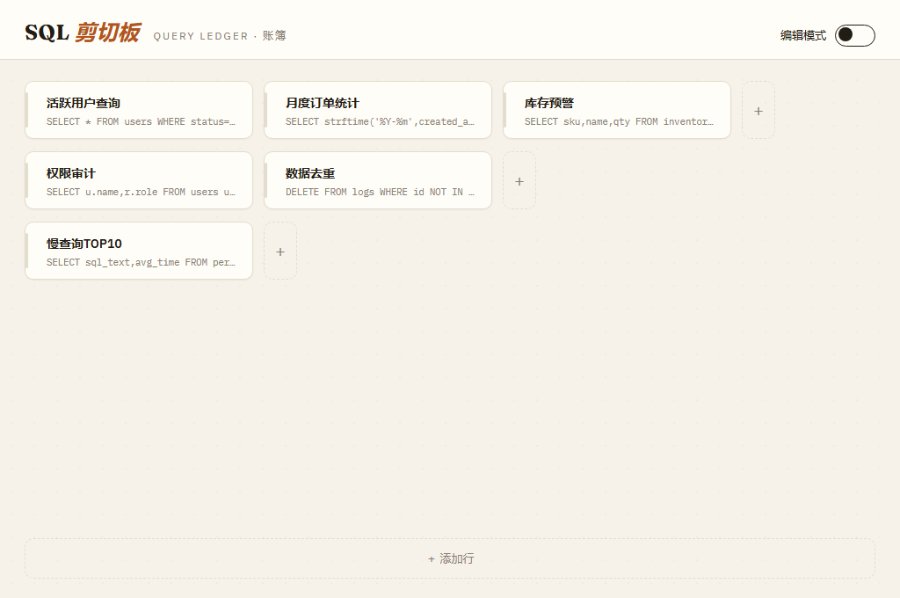
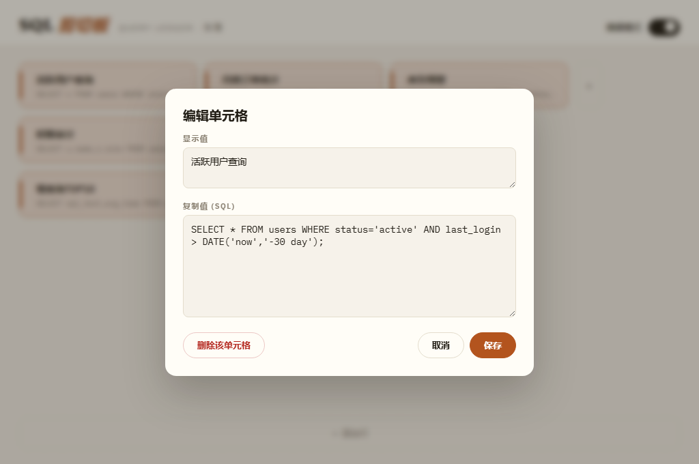

# SQL 剪切板

> 轻量便携的桌面 SQL 剪切板工具 —— 可自由拓展的表格管理常用 SQL，单击单元格即复制。



## ✨ 功能特性

- **一键复制**：单击单元格，该格的「复制值」（SQL）立即写入剪贴板，并有 toast 提示
- **自由拓展的表格**：行、列数量不限 —— 每行末尾「＋」追加列，底部「＋ 添加行」追加行
- **双值单元格**：每个单元格包含「显示值」（界面展示）和「复制值」（实际复制的 SQL）
- **编辑模式**：右上角开关打开后，点击任意单元格弹出编辑弹窗，可修改显示值 / 复制值或删除该单元格
- **SQLite 持久化**：数据保存在 exe 同目录的 `sql_clipboard.db`，程序拷走数据跟着走
- **便携单文件**：成品为单个 exe（约 9.5 MB），双击即用，无需安装
- **离线可用**：界面字体全部内嵌打包，不依赖网络



## 🚀 快速开始

### 方式一：直接使用

从 [Releases](https://github.com/evachxji/sql-clipboard/releases) 下载最新版本的 exe，双击运行。首次启动会自动在 exe 同目录创建数据库，并生成一条示例数据。

> 依赖系统自带 WebView2 运行时（Windows 10/11 均内置）。

### 方式二：从源码构建

**环境要求**：Node.js 18+、Rust 工具链

```bash
cd app
npm install
npm run tauri build
```

产物位于 `app/src-tauri/target/release/sql-clipboard.exe`。

开发调试（热更新）：

```bash
cd app
npm run tauri dev
```

## 🛠 技术栈

| 层 | 技术 |
| --- | --- |
| 前端 | React 18 + Vite，界面为「Ledger 账簿」设计（Fraunces / IBM Plex 字体） |
| 桌面框架 | Tauri 2（Rust），系统 WebView2 渲染 |
| 数据库 | SQLite（rusqlite，bundled 内嵌编译） |
| 剪贴板 | arboard（Rust 原生写入） |

## 📁 项目结构

```
├─ app/                  # React + Tauri 主程序
│  ├─ src/               #   前端源码（界面、交互）
│  └─ src-tauri/         #   Rust 后端（SQLite、剪贴板命令）
├─ designs/              # 三套 UI 设计方案（可交互 HTML 原型）与截图
└─ sql_clipboard.py      # 早期 Python + Tkinter 版本（已归档，仅供参考）
```

## 📝 使用说明

1. **复制 SQL**：直接点击单元格 → SQL 已进剪贴板，到目标处 Ctrl+V 即可
2. **新增便签**：先点底部「＋ 添加行」，再点行尾「＋」加列
3. **编辑内容**：打开右上角「编辑模式」，点击单元格，在弹窗中填写显示值与 SQL，保存
4. **删除便签**：编辑弹窗中点「删除该单元格」